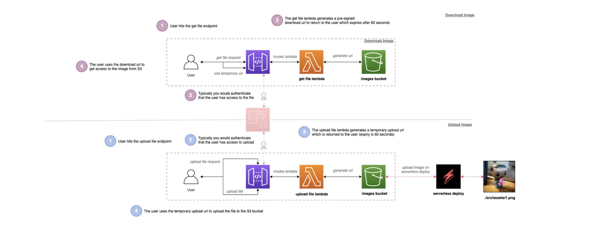

# serverless-pre-signed-urls

## Introduction

Practical example of using AWS S3 pre-signed URLs for uploading and downloading images to private S3 buckets. Supporting repo for the blog post: [Serverless AWS S3 pre-signed URLs 🚀](https://leejamesgilmore.medium.com/serverless-s3-pre-signed-urls-e52eebad8d2d)

### What are we building?

We are going to walk through building a solution which allows a user to upload png images and also retrieve them from a private bucket which they don't have IAM permissions or access crdentials for 😜

### Architecture Overview

This will build out the following architecture:

## Getting started

To get started, you can run the following commands from the root directory:

**Note: This will incur costs in your AWS account which you should account for.**

`npm i`

`npm run deploy:develop`

This will install the dependencies for the project and deploy the project to AWS.

> To remove the project you can run: npm run remove:develop

## Invoking the endpoints

Once deployed, you can invoke the three different endpoints using the postman file found here `./postman/`
